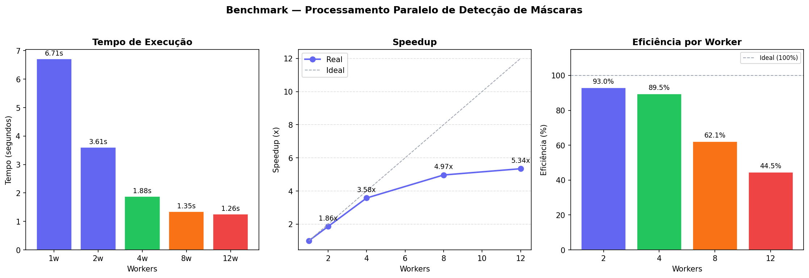
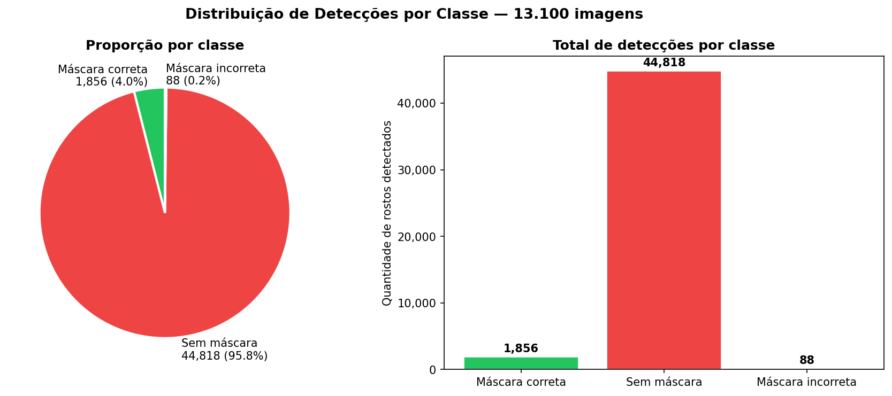

# 😷 Projeto Programação CD — Detecção de Máscara COVID-19

## 🎯 Objetivo do Trabalho

Este projeto foi desenvolvido para a disciplina de **Programação Concorrente e Distribuída**, com dois objetivos complementares:

1. **Técnico** — demonstrar conceitos de programação concorrente aplicados a um problema real de visão computacional, comparando desempenho serial vs. paralelo, calculando speedup e eficiência.

2. **Social** — oferecer uma ferramenta capaz de auxiliar na análise do comportamento de pessoas em ambientes públicos durante crises sanitárias, como a pandemia de COVID-19. A automação da identificação do uso correto, incorreto ou ausência de máscara facial pode apoiar:
   - Estudos epidemiológicos sobre adesão a medidas de proteção
   - Monitoramento de ambientes públicos (estabelecimentos, transporte, eventos)
   - Geração de dados quantitativos para políticas públicas de saúde

A ideia central é mostrar que ferramentas de processamento concorrente não servem apenas para ganho de performance — elas também tornam viável a análise de grandes volumes de dados (no caso, 13 mil imagens) em um tempo prático, algo que seria inviável de fazer manualmente.

## 📋 Sobre o Dataset

Este projeto utiliza o **Covid Face-Mask Monitoring Dataset**, um conjunto de dados para classificação do uso correto de máscara facial, composto por imagens de pessoas em ambientes públicos capturadas durante o período da pandemia de COVID-19.

O dataset contém imagens anotadas no formato **YOLO**, com três categorias de uso de máscara, permitindo identificar não apenas a ausência da máscara, mas também o uso incorreto (abaixo do nariz, no queixo etc.).

## 📊 Informações do Dataset

| Informação | Detalhe |
|---|---|
| 🗂️ Subconjuntos | Full_Dataset, Training, Validation |
| 😷 Classes | 3 (with_mask, without_mask, mask_weared_incorrect) |
| 🖼️ Total de imagens utilizadas | 13.100 imagens |
| 📐 Formato das anotações | YOLO (arquivos `.txt` com bounding boxes normalizados) |
| 📁 Formato das imagens | JPEG / PNG |
| 💾 Tamanho total | 3,51 GB / 26.200 arquivos |
| 🔗 Fonte | Covid Face-Mask Monitoring Dataset |

### Classes detectadas

| ID | Classe | Descrição |
|----|--------|-----------|
| 0 | `with_mask` | Máscara usada corretamente (cobrindo nariz e boca) |
| 1 | `without_mask` | Pessoa sem máscara |
| 2 | `mask_weared_incorrect` | Máscara usada de forma incorreta |

## 📁 Arquivos do Projeto

| Arquivo | Descrição |
|---|---|
| `preparar.py` | Roda o YOLOv8n em todas as imagens uma única vez e salva os bounding boxes em `bboxes.json` |
| `serial.py` | Lê o `bboxes.json` e classifica as imagens sequencialmente |
| `paralelo.py` | Lê o `bboxes.json` e classifica as imagens em paralelo usando 2, 4, 8 e 12 processos |
| `graficos.py` | Gera os gráficos de desempenho e distribuição de classes a partir dos CSVs |

## 🔍 Como os Scripts Funcionam

### Arquitetura em duas etapas

O projeto separa o processamento em duas etapas para isolar o tempo de inferência do modelo YOLO do tempo de classificação paralela:

```
Etapa 1 — preparar.py
  └── Roda YOLOv8n em todas as imagens (executado uma única vez)
  └── Salva bounding boxes detectados em bboxes.json
  └── Tempo do YOLO NÃO é contado no benchmark

Etapa 2 — serial.py / paralelo.py
  └── Lê bboxes.json (sem chamar o YOLO)
  └── Classifica cada bbox por proporção altura/largura
  └── Tempo medido aqui = tempo puro de classificação paralela
```

Essa separação permite medir o ganho real do paralelismo, sem o gargalo da inferência do modelo neural.

---

### Captura das Imagens

O `preparar.py` percorre automaticamente todas as subpastas do dataset usando `os.walk()`, coletando o caminho de cada imagem `.jpg` ou `.png`:

```python
def coletar_imagens(base_dir):
    imagens = []
    for root, _, files in os.walk(base_dir):
        for f in files:
            if f.lower().endswith((".jpg", ".jpeg", ".png")):
                imagens.append(os.path.join(root, f))
    return sorted(imagens)
```

Independentemente de como as subpastas estão organizadas (Training, Validation, Full_Dataset), todas as 13.100 imagens são encontradas automaticamente.

---

### `preparar.py` — Detecção com YOLOv8n

Usa o modelo `yolov8n.pt` (YOLOv8 nano) pré-treinado no dataset COCO para detectar pessoas em todas as imagens. O processamento é feito em **batches de 16 imagens** com resolução reduzida de **320px** para maior eficiência em CPU.

Para cada imagem, salva no `bboxes.json` a lista de bounding boxes detectados `[x1, y1, x2, y2]`. Este arquivo é a entrada para o `serial.py` e `paralelo.py`.

Este script é executado **uma única vez** — não é necessário rodar novamente a menos que o dataset mude.

---

### `serial.py` — Processamento Sequencial

Lê o `bboxes.json` e classifica cada bounding box em uma das 3 classes, uma imagem por vez. A classificação usa a **proporção altura/largura** do bounding box como heurística:

```python
def classificar_deteccao(box):
    proporcao = altura / largura
    if proporcao > 1.6:
        return "without_mask"      # rosto visível — bbox alto e estreito
    elif proporcao < 0.9:
        return "mask_weared_incorrect"  # bbox largo — máscara deslocada
    else:
        return "with_mask"         # proporção equilibrada — máscara correta
```

Para gerar carga mensurável de CPU no benchmark, o processamento é repetido **500 vezes** — técnica padrão em benchmarks quando a tarefa individual é muito rápida para ser medida com precisão.

Ao final, salva o tempo total em `tempo_serial.txt` e os resultados em `resultados_serial.csv`.

---

### `paralelo.py` — Processamento Paralelo

Usa a mesma lógica de classificação do `serial.py`, mas distribui as imagens entre múltiplos processos usando `multiprocessing.Pool`. O script testa automaticamente 4 configurações:

| Workers | Imagens por worker (aprox.) |
|---------|-----------------------------|
| 2 | ~6.550 |
| 4 | ~3.275 |
| 8 | ~1.637 |
| 12 | ~1.091 |

Cada processo trabalha de forma **completamente independente** — recebe seu lote de bounding boxes e classifica sem se comunicar com os outros durante a execução. No final, os resultados são reunidos pelo processo principal e o speedup é calculado automaticamente comparando com o `tempo_serial.txt`.

Os tempos de cada configuração são salvos em `tempos_paralelos.csv`.

> ⚠️ **Windows:** O bloco `if __name__ == "__main__":` é obrigatório pois o Windows usa o método **spawn** para criar processos, diferente do Linux que usa **fork**. Sem esse bloco, cada processo filho tentaria executar o script inteiro novamente, causando um loop infinito.

## ⚙️ Como Executar

### 1. Instalar dependências

```bash
pip install ultralytics opencv-python numpy matplotlib
```

### 2. Configurar o caminho do dataset

Abra `preparar.py`, `serial.py` e `paralelo.py` e confirme a variável no topo:

```python
DATASET_DIR = "dataset-covid-mask"   # pasta raiz do dataset baixado
```

### 3. Executar

```bash
# Etapa 1 — roda uma única vez
python preparar.py

# Etapa 2 — benchmark serial e paralelo
python serial.py
python paralelo.py

# Etapa 3 — gera os gráficos
python graficos.py
```

## 📤 Arquivos Gerados

| Arquivo | Conteúdo |
|---|---|
| `bboxes.json` | Bounding boxes de todas as 13.100 imagens detectados pelo YOLO |
| `tempo_serial.txt` | Tempo de execução do processamento serial (em segundos) |
| `resultados_serial.csv` | Contagem de detecções por imagem (serial) |
| `resultados_paralelo.csv` | Contagem de detecções por imagem (paralelo, última config.) |
| `tempos_paralelos.csv` | Tempo, speedup e eficiência para cada configuração de workers |
| `grafico_speedup.png` | Tempo, speedup e eficiência por número de workers |
| `grafico_classes.png` | Distribuição das 3 classes detectadas |

### Exemplo de `resultados_serial.csv`

```
imagem,with_mask,without_mask,mask_weared_incorrect,total
Training/images/img_001.jpg,3,1,0,4
Training/images/img_002.jpg,0,2,1,3
Validation/images/img_003.jpg,5,0,0,5
```

### Exemplo de `tempos_paralelos.csv`

```
workers,imagens_por_worker,tempo_s,speedup,eficiencia_pct
2,6550,3.60,1.86,93.0
4,3275,1.87,3.58,89.5
8,1637,1.35,4.97,62.1
12,1091,1.25,5.34,44.5
```

## 📐 Métricas de Desempenho

| Métrica | Fórmula | Significado |
|---|---|---|
| Speedup | T_serial / T_paralelo | Quantas vezes ficou mais rápido |
| Eficiência | Speedup / N_workers | Aproveitamento de cada núcleo (ideal = 1.0) |
| Throughput | operações / segundo | Capacidade de processamento |

## 📈 Resultados Obtidos

**Dataset:** 13.100 imagens × 500 repetições = 6.550.000 operações de classificação

### Detecção YOLO (preparar.py — não contabilizado no benchmark)

| Etapa | Tempo |
|---|---|
| Detecção YOLOv8n (13.100 imgs, batch=16, 320px) | 415,95s |
| Total de bounding boxes detectados | 23.381 |

### Benchmark de Classificação (serial.py / paralelo.py)

| Versão | Workers | Tempo (s) | Speedup | Eficiência |
|--------|---------|-----------|---------|------------|
| Serial | 1 | 6,71 | 1,00x | 100,0% |
| Paralela | 2 | 3,60 | 1,86x | 93,0% |
| Paralela | 4 | 1,87 | 3,58x | 89,5% |
| Paralela | 8 | 1,35 | 4,97x | 62,1% |
| Paralela | 12 | 1,25 | 5,34x | 44,5% |

### Gráficos

<!--
  Depois de rodar `python graficos.py`, os arquivos
  grafico_speedup.png e grafico_classes.png serão gerados
  na raiz do projeto. Adicione-os ao repositório e a sintaxe
  abaixo vai exibi-los automaticamente no GitHub.
-->

**Tempo, speedup e eficiência por número de workers:**



**Distribuição das classes detectadas:**



## ⬇️ Como baixar o dataset

As imagens não estão incluídas neste repositório devido ao tamanho dos arquivos (3,51 GB).

Faça o download pelo link abaixo e extraia mantendo a estrutura de pastas original:

🔗 **[Covid Face-Mask Monitoring Dataset](#)**

A estrutura esperada após a extração:

```
dataset-covid-mask/
├── Full_Dataset/
│   ├── images/
│   └── labels/
├── Training/
│   ├── images/
│   └── labels/
├── Validation/
│   ├── images/
│   └── labels/
├── classes.txt
└── data.yaml
```
